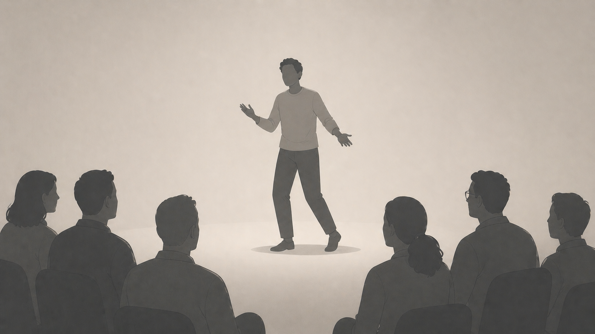
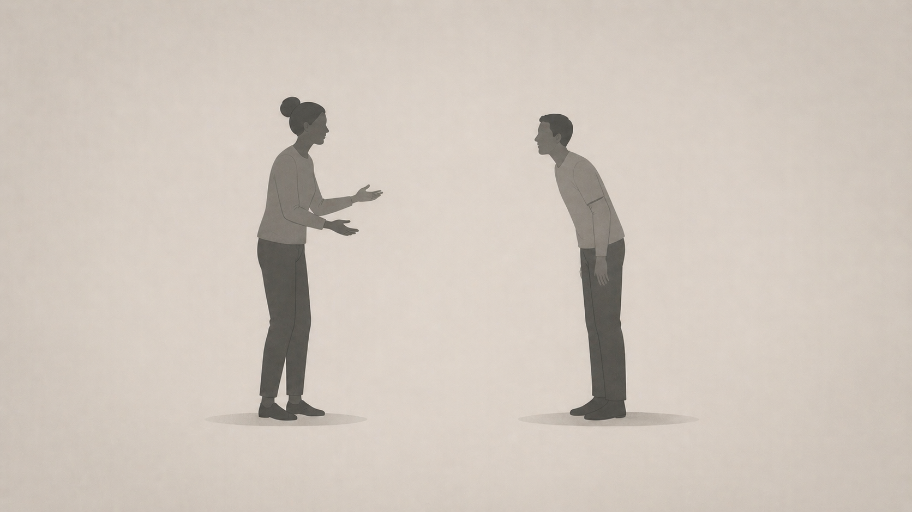
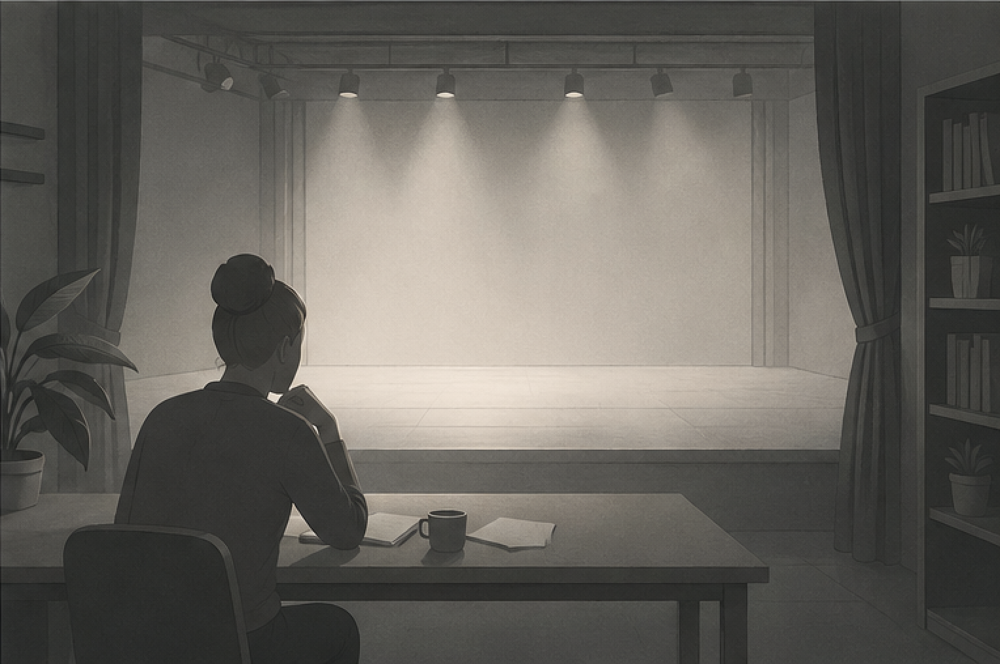

import YouTubeEmbed from '../../components/YouTubeEmbed.astro';

I could feel the tension building between my ears. I was in a room of senior leaders at a conference, and I had been selected to present our team's findings to that room. It was a chaotic few minutes of compiling everyone's ideas, sat on a table with my boss' boss who was quietly assessing me.

 

 

If this had been a few months ago, I would have been so focused on the idea of speaking that I would stop listening. The heat would prickle up my neck as I felt the pre-emptive embarrassment of saying something wrong. I would have written notes down furiously, eager to get the details right, but not really processing what was being said. I would have said words and sat down feeling numb and exhausted. No matter how many times I had done it before, anxiety would rule the day.

 

This time I had really listened to all the ideas and had managed to break it down into something I could communicate confidently. Somehow, I delivered the quick speech, sat down, and didn't feel like the floor should swallow me up. It was exhilarating and when I sat in the moment I knew why it was so different this time. **Comedy!**

## Stand-up comedy

When I signed up for stand-up comedy classes, I had an idea what it would be like but what I learnt was so much more than I expected. I thought the core of the learning would be about jokes and how to write them, but for me it was really about *presence*, *memory* and *making people feel comfortable*. 

I knew it would be a challenge. One of my friends told me I'd be good at it and that was enough of a nudge for me to mull over it for 6 months and finally sign up.

 

 

### Taking up space
In our first exercise, we picked up the microphone and stood in silence for 3 minutes. It was awkward and slightly terrifying. The class wrote down their impressions and we shared our thoughts on each other. Between the wild guesses about our lives there were insightful observations about our presence on stage.

 

I looked like I wanted to leave and stay simultaneously; both nervous and confident at the same time. I was surprised by how accurate the reviews were, and how much they resonated with me. I had never really thought hard about how I come across to others, I usually thought about content and how best to communicate it. How I show up is as much a part of the presentation as the content; I had to confront the feelings I had when people were looking at me.

 

This was the worst it was going to get. If we could survive that on a stage then anything else was going to be easier. When you go out there to open mics and perform, there's a lot of pressure to be funny, but the fact that you're getting up there and standing in front of people is already a win.

 

This was about *how* you show up. If you stand up there and look like you want to leave then people struggle to connect with you. If you look like you're having fun, people will have fun with you. It opened up a whole new world of communication for me. People listen when you look like you deserve to be listened to.

 

**When you are speaking you have to show that you deserve to take up the space.**

### Holding an audience
If you're at a talk or presentation, you want to feel like the speaker is talking to you, that they know what they are talking about and that they are inviting you into the conversation. Funnily enough, these are all stand-up comedy skills...
- Using simple, memorable language
- Remembering the key points without needing to read from notes
- Encouraging audience participation
- Holding yourself like you deserved to be there
- Making everyone feel included

 

When you're on stage, you have to remember your material and be able to adapt it to the audience. You have to be able to read the room and adjust your delivery accordingly. When they feel included then they want to hear what you have to say. This is not something you can learn from a book; it's something you earn from experience.

 

This was put to the test for me recently when I hosted an event. I had a loose script for my introduction then I compered. It was a lot of pressure but I found it supremely rewarding. I was able to use my newly found stand-up skills to connect with the audience and make the event feel more engaging. I threw myself out there and didn't overthink it. I had fun and the audience and speakers had fun with me. The room came alive and so did I.

 

All of these skills have made me a better communicator and leader. You can see how the course played out in my first gig here...

<YouTubeEmbed url="https://www.youtube.com/watch?v=1DyXZWAB2L8" title="My Stand-up Graduation Gig" />

## Improv comedy

Since learning stand-up comedy I have started classes in improv comedy and found a wholly different set of skills. Improv demands you to be in the moment and *listening* to what's happening around you. The game or the scene is successful when you're building off others, accepting their ideas and elevating them. You don't have a script, the scene emerges organically from the interaction you have with others within the constraints and rules of the game.

### Listening

I admit it. I was only half-listening most of the time in standups and other ceremonies. I was focused on what I was going to say next, or on what slack message had just come in. I wasn't actually listening properly. I also caught myself jumping to what was *wrong* with what was being said, rather than what was *right* about it. I was looking for the flaws and the problems, not the opportunities and the good ideas. Improv has really helped me to listen properly and to be in the moment. It's also helped me to be more open-minded and to be more accepting of others' ideas.

 

I wasn't a monster, but I was disengaged with my team. Really honing in on the "Yes, and..." mentality has changed the way I mentor and manage my team. When one of my engineers comes to me with a problem and a half-baked solution, I take a moment to really listen to what they're saying and then accept what they have done to try and fix it. That does a few things:
- Makes them feel heard and valued
- Makes me humble and open to their ideas
- Gives us a starting point to work it out together

I have explored how to [dismantle an argument](/blog/2026-02-21-philosophy-and-software-bad-arguments) but improv has changed the way I approach these situations.

 

There's an adage around helping others - you either take over or lean in. Taking over means solving it for them; leaning in means meeting them where they are and walking it through together. The improv mentality put me immediately into the space where I'm leaning in rather than taking over. That pause before helping forced me to appreciate the work and thinking they had already done. It was way more *human* than whatever I had been doing before.

 

**I became a tech lead that was with my team, not managing them.**

## Confidence without a plan
Long-form narrative improv is a different beast. You have to quickly establish the rules of the world you're in, the characters, the relationships, and the settings - all built collaboratively and in real time. You have to remember all of it and build on it to create a story that's cohesive with your fellow performers. Getting it right is absolutely one of the best feelings in the world. Underneath it are some skills that directly relate back to engineering leadership.

 

Reading the room quickly and figuring out where everyone is - who are they, what level are they at, what do they know and how can I communicate what I need to with them? You use this skill in every conversation or presentation. I could feel the difference after I'd done a few improv classes.

 

When you're starting an improvised play, you have no idea where it's going to end up. All you can do is rely on your own skills and everyone around you to make it a success. You have to trust you will be able to respond to what comes, but if you falter that someone else will pick you up. When you work in software engineering, the reality is that even if you have a plan, it's going to change. You have to be able to adapt and respond to the changes and the challenges that come your way. You have to be able to trust yourself and your team to navigate through it.

 

When I presented back to that room of senior leaders, I had the nods of people in the room and the smiles and engagement of my peers to get me through it. I had my team, who spoke up and added to support the points I was making. It wasn't just me up there, it was all of us. The confidence I felt was based on trust that the people in the room wanted me to succeed because it meant they did too.

 

**Confidence, without a plan, is a skill in both trusting yourself and others.**

## Funny how things work out...

 

 

I wasn't expecting a comedy course to help me with my leadership skills, but here we are. What it has done is revealed a whole host of skills that I didn't know I needed to polish. And honestly, it has been so much fun! The last unexpected benefit has been bringing fun into my day-to-day work life - not forced, not for the sake of it - but when you're having a bit of fun, your team is and you get so much more out of everyone.

 

Being an engineering leader is often about having all the answers. The culture of tech is obsessed with preparation, precision and having the right answer before anyone else does. Beyond presentation and communication skills, comedy teaches you how to be prepared but be ready for the unexpected, to be confident but humble, to be engaged and to listen. Nobody taught me these skills formally, but they are now powerful tools in my arsenal.

 

If you are in the Leeds area and ever want to unlock this for yourself then check out [Laugh at Leeds](https://www.laughatleeds.com/). It's a wonderful community run by a fantastic team who has been so supportive of me and my comedy journey. I can't recommend it enough.

 

The most important reason to pick up something like comedy is that it's for you. All of these skills are transferable to your work life and it's really amazing that I feel comfortable standing up in a room of leaders and being me. The main thing I got from these courses was comfort in my own skin, a group of friends, a new hobby that's exhilarating and a face that hurts from laughing so hard. If you want to do it, do it for you. Your team might thank you too, but it's not for them!

 

I'm about to start a course in "Musical Improv" and I can't wait to see how it turns out. Well... back to practicing.
