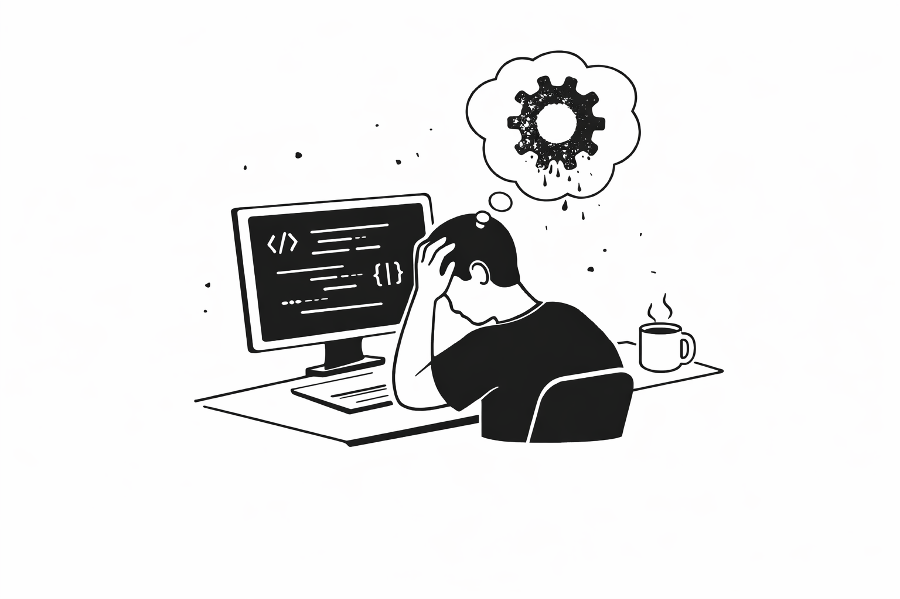
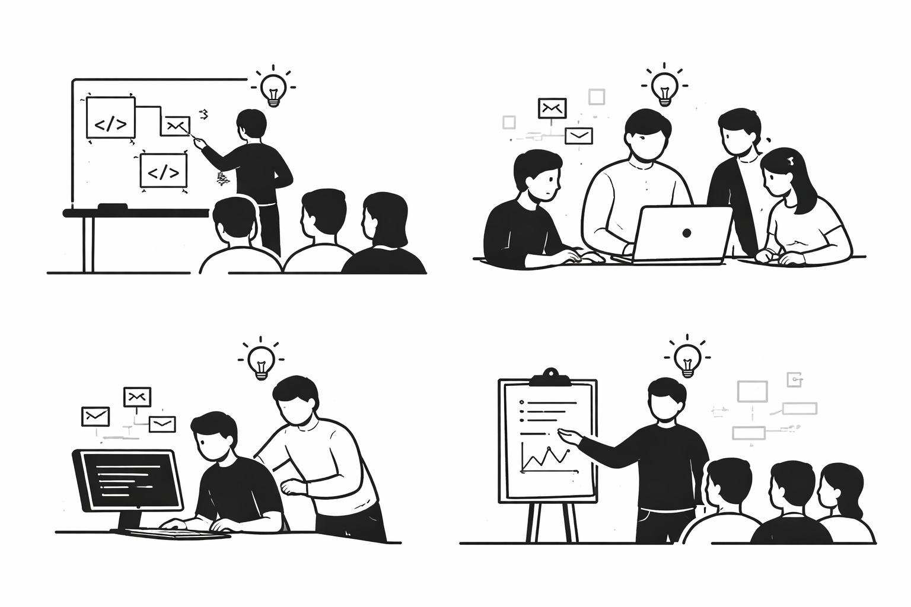
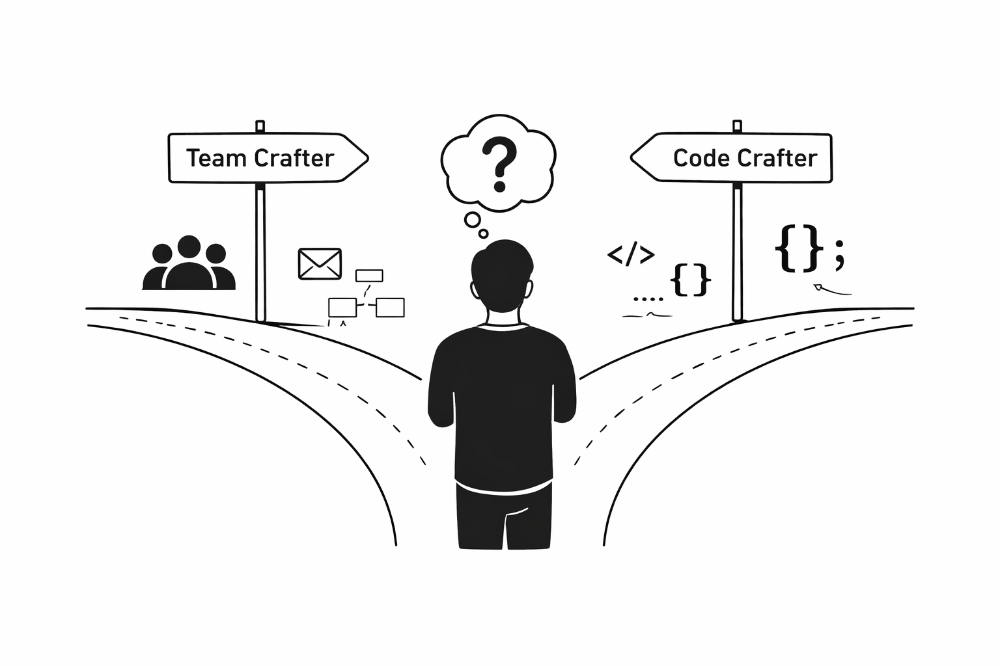

This post is part of the [Return to Engineering](/tags/return-to-engineering) series, where I share my journey of returning to hands-on software engineering.

## When did I stop writing code?

It’s been over a month since I last committed code at work. I didn’t notice at first. I realised it while helping a developer debug an issue. Something simple - a change to the testing framework, an environment variable missing from the pipeline. The kind of thing I would have fixed instinctively before but this time I had to pause and figure it out. I wasn't close enough to the code to have the answer ready.

 

I catch myself in this moment more times than I care to admit and it immediately triggers a wave of imposter syndrome. 
- Can I still call myself a hands-on engineer?
- Am I still good enough to be leading a team?
- Have I lost my edge?

It's a tough pill to swallow, every time.

 

It's a strange feeling - I can see what's wrong and I can guide my team to a solution. There's a quiet question underneath it all: **Would I be able to fix this myself if I had to?**
The answer is yes, but not as quickly as I'd like.

 

### How close am I to the code?

I still stay close to the code, just not in the way I used to. I spend my time
- reading and reviewing code
- writing and reading documentation
- shaping our architecture, monitoring, alerting, standards and testing strategy
- improving our development processes
- communicating all the above to the team
- talking to other teams about code and architecture
- explaining everything to non-technical stakeholders

 

There isn't much time for writing code around those things! There are also a lot of activities that I do that are aimed at keeping the team enabled to do their best work that aren't even on the list.

 

As an engineering leader, you need a mental model to deal with the fact you're more of a reader than a writer of code to save yourself from imposter syndrome. Most engineers [spend the majority of their time reading code rather than writing it](https://cacm.acm.org/research/from-code-complexity-metrics-to-program-comprehension/). So why does it feel so much worse when it becomes your *primary* mode?

## Creation vs. comprehension
Writing a feature is an obviously creative process. You have a problem, you design a solution and then you implement it in code. It's a satisfying process because you can see the results of your work immediately. You can also get into a flow state where you're completely immersed in the problem and the solution. It's a very rewarding experience. It's a direct way to feel the craft of engineering and to feel like you're making a tangible contribution to the product.

 

Reading code is an interpretive activity. You're trying to understand what the code does, what its limitations are, how it fits into the larger system, and ultimately what the creator of the code was thinking. You're trying to comprehend it.

 

**Writing code moves things forward, reading code tells you whether it's right.**

 

Reading code is a universal activity that all engineers do. Senior engineers can be much better at it because they have been exposed to different models, different problems and have a broader awareness of the context in which they are working. Turn the dial up to 11 and then you've got your tech lead, where the expectation is that they bring all that "wider awareness" to the team and help them navigate the codebase and the wider technical landscape to make the best decisions.

 

For a tech lead, you can feel like the gatekeeper of quality, future-proofing and best practices. Ultimately, you are on the hook for your code working and looking good and that means... PRs and lots of them. You can be quite firmly in the reading camp.

### Redefining creativity for an engineering leader

 

 When you're reviewing lots of PRs, you're witnessing other people's creativity and getting into their heads. It's not your flow state, it's not your problem - it's theirs. You're judging - is this good enough? Does it do what it's supposed to? Is it maintainable? Your goal is to guard the product from issues and help the person who wrote it get better. **Mentoring and feedback** is a creative process in its own right - figuring out how to best explain, communicate and distil information into a way that can be digested and applied. There's the emotional aspect too - how do you want them to feel after the critique? How do you tell them it's bad without destroying their motivation and confidence?

 

Beyond PRs, reading code is about expanding your knowledge and awareness so that you can bring that back into the team and improve the quality of what we're producing overall. It's not about you doing it for yourself, you're doing it for the team. Which is where the part about distilling, reflecting and communicating comes in. As a tech lead, you're a conduit for the information that's relevant to them. You use it to shape the architecture, spot improvements to processes, feed back into standards, checks and balances. 

 

**You're not creating the code, but you're creating the ecosystem in which the code is created**.

 

On the flip side, when there's a bug or a problem that's emerged from the code, you need to be able to diagnose and understand the code quickly and find the root cause. The broader awareness you gain from being outside and inside the code can make you a real super-diagnoser-debugger-general. Sometimes you need to be that person as the buck stops with you. If nobody understands the problem, that's your job. This is pure **problem-solving** and that's a creative process.

 

Finally, there's nothing better than *getting around a whiteboard* and discussing a problem with your team. Getting under the hood of the system with a big picture, stretching their understanding and your own and problem solving at scale is such an interactive and creative process that you can really feel the collective craft of the team.

### A short note on AI
AI code generation effectively cuts out the creative part of writing code and turns it into a reading activity. I explored what impact this has on an engineering team in [When Code Plays Itself](/blog/2026-03-23-when-code-plays-itself/). I think over time, AI will cause more of this uncomfortable reading vs. writing tension in more engineers.

## Am I still hands-on?

 

It's a misconception that being hands-on means writing code. 
What it really means is being close enough to the work to understand it, shape it, and take responsibility for it. 

 

When I say I'm not hands-on, what I really mean is I feel *distant from the craft*. Everything I do as a technical leader is less tangible than writing code. There are pockets of creativity in what I do but it's not the craft I learnt to get here. Somewhere along the way I stopped being the person who creates code and became the person who evaluates it.

 

Over time I've gotten really good at reading code and the activities that come along with that. There's still a little voice in my head that says "Could I have written this code?". I know the answer is "yes, but slower than the person who wrote it". I'm a rusty writer but a good reader. That little voice is *imposter syndrome*. Part of the [return to engineering](/tags/return-to-engineering) series has been for me to confront that voice and get in touch with that craftsperson feeling again.

 

I think the best way to deal with that is to redefine what being hands-on means... it's about being
- a person that knows enough about the technical work that everyone is doing
- the person with a deep understanding of the codebase
- the person able to guide and mentor others
- the person prepared to make informed decisions about the architecture and design of the system
- a critical reader of code
- a creative problem solver when things go wrong

 

I think I'm a *team craftsperson*, not as much of a code craftsperson right now... and that's OK. However, understanding how best to craft a team does mean knowing what it feels like to be a craftsperson in your team. You need to dive in every so often to get that feeling again and feel the friction firsthand. You need to know how to motivate and inspire the craft in your team and the best way to do that is to be a credible software engineer yourself.

 

**I think being a better code craftsperson will make me a better team craftsperson.**

 

Well, back to practicing...